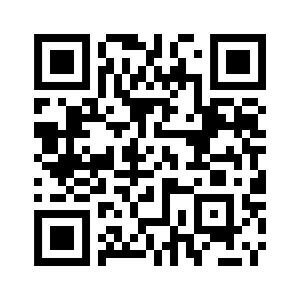

# Studentuppdrag

Region Östergötland vill fortsätta att vara i framkant, med vård, forskning och utbildning i världsklass. Därför behöver vi många olika sorters kompetens med olika typer av bakgrund. Vi har förutsättningarna för spännande karriärvägar, för att du ska kunna göra skillnad, och föra livet framåt. Inom regionen finns sjukhus i Linköping, Norrköping och Motala. Dessutom finns ett stort antal vårdcentraler och andra verksamheter, spridda över hela regionen. 

Utöver vårdutbildad personal finns personal från många andra utbildningsbakgrunder, t.ex. teknik, naturvetenskap, informatik, matematik, beteendevetenskap, ekonomi, juridik, HR. 

## Examensarbete, uppsats, kursprojekt eller praktikplats?

Vi har för det mesta möjlighet att erbjuda studentuppdrag från flera av Region Östergötlands olika verksamheter. Studentuppdrag kan genomföras på olika sätt, examensarbete, uppsats, praktik (obetald), kursprojekt m.m. Utöver listan nedan så är du givetvis välkommen med egna spontana idéer till projekt eller med kombinationsförslag som gränsar mellan de listade förslagen. Flera av förslagen kan göras tillsammans av flera studenter om så önskas. 

## Ansökningar
Ansökningar lämnas via [Exjobb](https://www.regionostergotland.se/ro/jobb-och-utbildning/utbildning-och-praktik/student/) eller [Praktik](https://www.regionostergotland.se/ro/jobb-och-utbildning/utbildning-och-praktik/praktikant), välj annons för antingen exjobb eller praktik. Frågor är välkomna till testochinnovation@regionostergotland.se.

Katastrofmedicinskt centrum (KMC), en av RÖ:s verksamheter, har även en egen kanal in för studentprojekt på [https://www.katastrofmedicin.se/sv/for-students/](https://www.katastrofmedicin.se/sv/for-students/). Ansökningar som görs genom annonserna som nämns ovan och som vi tror kan passa på KMC kommer vi att lotsa dit, så det spelar ingen roll vilken ansökningsväg du väljer.

_Under perioder av skärpta COVID-19-restriktioner är det betydligt svårare att erbjuda praktik (särskilt på plats fysiskt). Examensarbeten etc. kan ofta göras mycket bra även huvudsakligen på distans._

----------------      
      
Studenter på vårdutbildningar och i högre årskurser på civilingenjörsprogram i medicinsk teknik brukar kunna söka (betalda) [sommarvikariat](https://www.regionostergotland.se/Jobb-och-studier/Lediga-jobb/Sommarvikariat/). Sommarjobb 2023 inom medicinsk teknik söks senast 28/2 via epost till Ole.Ronningen@regionostergotland.se. 

Övriga uppdrag på denna lista är obetald studentpraktik, examensarbeten etc. kopplade till pågående utbildning.

------------------

# Öppna studentuppdrag (nu)

__Statistik och visualisering hos ICC__ 

Regionen har många IT-system, mellan flera av dem behövs integrationer som genomförs och underhålls av Regionens ICC ([Integration Competency Center](https://en.wikipedia.org/wiki/Integration_competency_center)). Stora mängder data av olika typer flödar varje dygn mellan systemen. Flera av integrationerna i är livsviktiga i vården, exempelvis sådana som gör att provresultat snabbt kommer från laboratoriesystemen till rätt vårdpersonal. Studentuppdragets syfte är att tillgängliggöra statistik och data från dessa plattformar och lösningar på ett intuitivt och aggregerat sätt, så att data kan användas för trendanalyser m.m. som i sin tur kan underlätta beslutsfattande inom ICC. (Se även mer [detaljerad beskrivning](https://github.com/regionostergotland/studentuppdrag/blob/master/Uppdragsbeskrivning_statistik_ICC.pdf).)

__Miljö och klimat__ 

Hör av dig med en ansökan om du har intresse av området. Exempel på tidigare studentuppdrag:
* __Visualisering av klimatpåverkan av dagens lunch.__ Hjälp oss visa klimatpåverkan av de matval som görs i vardagen. Se exempel 
* __Vilka kläder för vårdens medarbetare är bäst för klimatet?__ Under senaste åren har engångskläder blivit allt vanligare i vården. Vilka kläder ska användas för att uppnå bästa klimatnytta?
* __Uppföljning av elcykel-användning.__ RÖ har köpt in 26 st elcyklar som har varit ute i verksamheten i drygt ett år. Sammanställning av klimatnytta och resultat.
* __Visualisering och räkneexempel av resfria möten.__ Ta fram schablonmodell för att räkna klimatnytta och ekonomisk besparing med resfria möten.I uppdraget ingår också att ta fram en intuitiv visualisering av förhållandet mellan avstånd och antalet deltagare.
* __Jämlika patientresor__ Hur kan Region Östergötland arbeta för klimatsmarta och jämlika patientresor? Idag betalar patienter för att ta sin bil eller buss till sjukhuset, det kan påverka ekonomiskt utsatta grupper.
* __Visualisering av förbrukningsprodukters nyttjande__ Hur kan vården ta del av information som visar enhetens nyttjande av förbrukningsprodukter och dess klimatbelastning?

# Exempel på redan genomförda Studentuppdrag

### 2021
- Examensarbete [Vårdpersonalens perspektiv på en digital vårdcentral: Användning av videobesök i vården](http://liu.diva-portal.org/smash/record.jsf?pid=diva2%3A1621878&dswid=4264) av Ellen Liif, Kognitionsvetenskapliga programmet LiU.
- Kandidatarbete [Att digitalisera en akutmottagning](https://github.com/regionostergotland/studentuppdrag/raw/master/2021/Kandidatuppsats_Att%20digitalisera%20en%20akutmottagning.pdf) Av: Hanna Henriksson, Kognitionsvetenskapliga programmet LiU.
- Projektarbete: [Visualisera en patients tillstånd på en akutmottagning](https://github.com/regionostergotland/studentuppdrag/blob/master/2021/Visualisera%20en%20patient.pdf). Syftet med detta arbete var att undersöka om ett kroppsfigur-baserat gränssnitt kan vara ett komplement vid överrapporteringar och vad ett sådant gränssnitt borde innehålla. I arbetet användes prototypande som ett verktyg för kravställning. Av: Lisa Rönnqvist, Kognitionsvetenskapliga programmet LiU.
- Prototyp för att testa olika alternativ och ideer för ett eventuellt framtida chattsystem mellan patienter och vårdpersonal. Systemet fokuserar på förgrening av konversationer, markering av viktig text för att underlätta överlämning mellan vårdpersonal m.m. [https://github.com/regionostergotland/Chattsystem-prototyp-PUMvt2021/tree/release](https://github.com/regionostergotland/Chattsystem-prototyp-PUMvt2021/tree/release)
- Examensarbete: Adaptive OCR System for Medical Device Displays. Av: Louise Nybacka (Kommer kunna nås via [https://liu.diva-portal.org/](https://liu.diva-portal.org/))

### 2020
- Import av egna hälsodata från Google Fit (Android-telefoner m.m.) till journalsystem (EHR) och egen personlig journal (PHR). [https://github.com/regionostergotland/ipforregionen](https://github.com/regionostergotland/ipforregionen) Detta är en fortsättning och utökning av et projekt från 2019, se nedan.
- Prototyp av digital Akutjournal: [Designskiss i Figma](https://www.figma.com/proto/Kvywp2MSW73a1nPkVwu8zG/Digital-Akutjournal?node-id=578%3A68136&scaling=min-zoom), [programkod på GitHub](https://github.com/regionostergotland/vera), [dokument](https://github.com/jesjo430/vera/tree/master/documents).
- Kunskapsstyrning för nutritionsvård. Vilka behov har verksamheterna av kunskap, styrning och ledning för att nå regionens mål kring nutritionsvård? Behoven ska kunna genera lösningar för regionen. Förstudierapport som beskriver problemområdet finns här: [Förstudie](https://regionostergotland.github.io/studentuppdrag/2019/Nutritionsbehandling-191119.pdf).
- Prototyper för egenmonitorering, se [uppdrag](https://docs.google.com/document/d/1SzN3W3gOxLbpXnSqnjONfq4X7YhWJ85lgnXvdoUi2Pg/edit?usp=sharing) och resultatexempel: 1.[Rostbot](https://github.com/regionostergotland/Rostbot-chat-PUM-HT-2020). 2.Treet; [documentation](https://github.com/regionostergotland/documentation_Treet), [product](https://github.com/regionostergotland/treet_product) & [student group](https://regionostergotland.github.io/company4-webpage/).
- Översiktsvyer i akutjournal. Interaktionsdesign, kursprojekt: 
    * [Grupp 7](https://github.com/regionostergotland/studentuppdrag/raw/master/2020/Grupp%207%20Interaktionsdesign%20Projektsammanfattning.pdf) fokuserade på avdelningsvy (många patienter) Se även [videoklipp](https://sway.office.com/OpHFH5GQXMTXHxve#content=kk39aWM6M0ckyy)
    * [Grupp 8](https://github.com/regionostergotland/studentuppdrag/raw/master/2020/Grupp%208%20Digitaliserad%20akutjournal.pdf) fokuserade även på individuell patient (tidslinje-vy m.m.)
- Kandidatuppsats: [Tämjande av vilda system – En fallstudie av Region Östergötlands arbete med att hantera vilda system](https://github.com/regionostergotland/studentuppdrag/raw/master/2020/LIU-IEI-FIL-G--2002296--SE.pdf)
(Taming of Feral Systems – A Case Study of Region Östergötlands Undertaking to Deal with Feral Information Systems) Av Marcus Larsson & Rasmus Thunberg 

### 2019
- Studie om digitala vårdcentraler ur ett vårdpersonalperspektiv. [En fallstudie om vårdpersonals acceptans av en videomötestjänst](http://urn.kb.se/resolve?urn=urn:nbn:se:liu:diva-164573); Josefin Lidh.
- [vITal](https://github.com/regionostergotland/vITal-studentprojekt) webbapplikation för mobil registrering av vitalparametrar och beräkning av risk (med NEWS2-skala) samt scanning av patientarmband med mobil. Lagring i openEHR-plattform.
- [MedCom](https://github.com/regionostergotland/MedCom-TDDC88) webbapplikation för att från andra vårdgivare akut skicka in bilder m.m. till brännskadejouren för bedömningshjälp
- Informatisk modellering och framtagning av dynamisk mall för patologisvar för bröstcancer. [Modelling breast cancer pathology reports using SNOMED CT and openEHR](http://urn.kb.se/resolve?urn=urn:nbn:se:liu:diva-159746); Thérèse Högberg Mårder.
- Import av hälsodata från Google Fit (Android-telefoner m.m.) till journalsystem. [Webbapplikation för inrapportering av hälsodata till digitala journalsystem](http://urn.kb.se/resolve?urn=urn:nbn:se:liu:diva-157977); Alexander Vestin, 
David Lantz, Erik Norrestam Held, Matilda Olsson Kaalhus, Mattias Salo, Noah Hellman, Sofie Liljedahl. 

### 2017
- Akutplattan: HLR-stöd på surfplatta; Lisa Ax, Oskar Joelsson, Oscar Magnusson, Susanna Dahlgren, Kim Larsson, Daniel Månsson, Olle Renius - [https://github.com/regionostergotland/akutplattan](https://github.com/regionostergotland/akutplattan)	
- Visualisering vårdprocesser; Otto Bergdahl, Petter Granli, Gunnar Grimsdal, Johan Nilsson, Peter Arvidsson, Victor Bennich, Hakan Celik - [https://github.com/regionostergotland/VisualCare](https://github.com/regionostergotland/VisualCare)
- Pulsoximetri: Signalbehandling i realtid på Raspberry Pi. [Pulse Oximetry: Signal Processing in real time on Raspberry Pi](http://urn.kb.se/resolve?urn=urn%3Anbn%3Ase%3Akth%3Adiva-210234); Thunholm, Malin
- Kandidatuppsats: [Feral Information Systems i Vårdverksamheter: En fallstudie om risker som kan uppstå när de inte uppfyller vårdverksamheters krav på IT-system](http://urn.kb.se/resolve?urn=urn%3Anbn%3Ase%3Aliu%3Adiva-139119) Av: Anders Breid & Lemlem Mehari

### 2016
- Prestanda och funktionalitetstest av Raspberry Pi; Manuela Tesanovic  -
[Rapport](http://urn.kb.se/resolve?urn=urn%3Anbn%3Ase%3Aliu%3Adiva-133978)
- Using Node-Red to Connect Patient, Staff and Medical Equipment; Junior Asante & Joel Olsson
[Rapport](http://urn.kb.se/resolve?urn=urn%3Anbn%3Ase%3Aliu%3Adiva-129781)

### 2015
- OpGuide - stöd för operationsförberedelser - studentprojekt som vidareutvecklats och används dagligen, se video: [https://youtu.be/k4r-pHpwdKo?t=14](https://youtu.be/k4r-pHpwdKo?t=14) Inför operationer och andra åtgärder används handböcker och checklistor av olika slag för att ta fram rätt utrustning och se till att göra rätt förberedelser. Uppdraget var att designa och implementera en körbar web-baserad prototyp som kan användas på både på mobila enheter (t.ex. surfplattor) och från stationära datorer när man t.ex. riggar i ordning inför operationer. Ett gränssnitt för att underhålla handböckerna och listorna ingick.
- Behovsdriven utveckling inom den offentliga sektorn - Självservice vid en akutmottagning – Vems behov väger tyngst; Sanda Gagic & Sandra Svanberg - [Rapport](https://regionostergotland.github.io/studentuppdrag/2015/Magisteruppsats-15-02101%20Sanda%20Gagic%20%20Sandra%20Svanberg.pdf)
- Akutjournalens övergång till digital plattform: Vad som krävs för att ersätta pappersformatet
Linda Hallström [Rapport](http://urn.kb.se/resolve?urn=urn%3Anbn%3Ase%3Aliu%3Adiva-120627) - (Handledning från Cambio)
- RFID-baserad identifikation i vården; Patrik Ström/Thorell -
[Rapport](http://urn.kb.se/resolve?urn=urn%3Anbn%3Ase%3Aliu%3Adiva-130720) - [Källkod](https://github.com/paguz/RPi-RFID)
- Emulering av medicinsk BLE-utrustning med Raspberry PI 2 och Bluegiga BLED112; Niclas Kaiste - [Rapport, preliminär version](https://drive.google.com/file/d/0BwdHmPbK5e3STWRVNnBoV0VUMGs/view?usp=sharing)

### Avslutade projekt, där fortsättningsprojekt är möjliga om/när handledare har tid

__Bedömningsverktyg för bilkörningsförmåga__ Rehabiliteringsverksamheten söker en metod för att smidigt kunna bedöma en persons förmåga till trafiksäker bilkörning efter hjärnskador. Idag används en förenklad körsimulator som nu blivit föråldrad. Under 2014 hölls en innovationstävling för att uppmuntra framtagande av nya lösningar. Det vinnande bidraget från företaget Cybercom adresserade en delmängd av önskemålen och kan utgöra en grund för vidare design och utveckling.

__Mobilitet och Positionering med koppling till IT-stöd__ Teknisk utveckling och/eller utvärdering: Integration av positioneringsfunktioner med andra IT-system. Kan och vill man få mobila system att automatiskt lyfta fram information relaterad till det rum eller den patient man befinner sig hos? Är det lämpligt att använda sig av positionsinformation som en del i säkerhets- och inloggningsrutiner?

__Grafiska symboler och symbolspråk__ 
Utveckling och utvärdering av symbolspråk för medicinska terminologisystem. Principerna bakom det medicinska visualiseringsspråket VCM är intressanta, men symbolvalen är inte självklara och estetiken kan förbättras. Hur kan principena tillämpas på bättre och mer tilltalande sätt? Kan utvärderingsstandarder för symboler tillämpas? Hur behöver symbolspråk utformas för att tillämpas på delar av t.ex Snomed CT? Hur kan symbolerna användas för patientöversikter? Projekt inom detta område lämpar sig för de som har intresse för t.ex. grafik och kognitition. (Avslutat kandidatarbete i kognitionsvetenskap finns som grund - fortsättning möjlig)

__Artificiell intelligens och beslutsstöd__ I många situationer finns det en önskan om möjlighet till automatiserade beslutsstöd, exjobb är t.ex. på gång avseende beslutsstöd i mobil akutjournal. Regionen tillämpar redan t.ex. stroke-förbyggande beslutsstöd och håller på att införa stöd på fler områden. Om du har intressen/kompetens inom AI eller beslutsstöd så kan vi diskutera uppdrag.

__Kontinuerlig synkronisering av HTML5-dokument/data (multi-user & multi-device)__ Det finns olika lösningar för att koppla HTML-gränssnitt till datamodeller (på klientsidan) så att de hålls synkroniserade med varandra (om den ena ändras så återspeglas det direkt i den andra) vissa lösningar kan även stödja separation av grafisk design från logikdesign. Ett sådant exempel är ramverket AngularJS. För att hålla datamodeller på klientsidan synkroniserade med modeller på serversidan och med andra klienter (och med viss tolerans för dåliga nätförbindelser) kan “operational transformation” användas. Ett sådant ramverk är ShareJS. Uppdrag: utred och testa om AngularJS och ShareJS eller andra lämpligar ramverksalternativ fungerar bra ihop och om de skulle kunna användas som en grund i inmatningsgränssnitt för t.ex. patientjournalsystem.

### Avslutade projekt där fortsättning ej är planerad i dagsläget

__Modell för omvårdnadsdokumentation i patientjournalen__
I journalsystemet Cosmic dokumenteras omvårdnad i mallar, t ex nutrition, fall, trycksår, munhälsa m.m. Mallarna består av sökord framtagna ur forskning och praxis. Mallarna följer ibland ett processtänk. Det är svårt för en sjuksköterska att dokumentera vid rätt tidpunkt, i en process eller med rätt innehåll. För vad ska vi egentligen dokumentera? Utifrån vems perspektiv ska dokumentationen ske? För den som vill visa vad som gjorts, för den som kommer nästa pass, för uppföljning på generell nivå eller utifrån vad forskningen anser är rätt? Det finns även lagar som styr vad som ska dokumenteras, men dessa är ibland ej så styrande. Därför behöver vi undersöka vilka behov finns av dokumentation, vad säger forskningen och lagen. Därefter behöver en modell föreslås kring vad dokumentationen i en patientjournal ska innehålla. Förslag är att utgå från en s.k. omvårdnadsmall, t ex sår eller nutrition. Uppdraget lämpligt för student inom kognitionsvetenskap på masternivå eller liknande.

__Utvärdera desinfektions-metoder baserade på bl.a. ozon, väteperoxid och UV-ljus__
Det är viktigt att kunna desinficera utrymmen och modern teknisk utrustning (utan att förstöra dem). Detta uppdrag innefattar att testa och jämföra olika metoder i praktiken. Biologikompetens krävs.

__Utbildnings- och beslutsstöd för personer som drabbas av akut hjärtinfarkt.__
Detta är studentprojekt är en del av forskningsprojektet Act4Heart. Det övergripande syftet med Act4Heart projektet är att utvärdera effekterna av en utbildnings-intervention genomförd via motiverande samtal och interaktiv IT för patienter med nyligen genomgången hjärtinfarkt och deras närstående. Hypotesen är att användandet av dessa tekniker kommer att öka ambulansanvändandet och därmed förkorta prehospital agerandetid hos de patienter som återinsjuknar i hjärtinfarkt.  
Student-delprojektets syfte  är att utveckla och testa användarvänligheten och genomförbarheten av ny IT (interaktiv websida/applikation) genom att använda en deltagande forskningsdesign med applikationsutvecklare patienter, kliniker och forskare involverade i alla steg.

__Jämför multitouch-ramverk för HTML5 på olika plattformar.__ Multitouch-gränssnitt finns i en mängd format och fabrikat. Utred, testa och jämför olika lösningar baserade på HTML5 etc som potentiellt skulle kunna användas på ett enhetligt sätt för de flesta av dem (smartphone, surfplatta, visualiseringsbord, stor väggskärm).

__Håll maskinen vid liv så att den kan rädda liv.__ Medicinteknisk utrustning underhålls och servas i förebyggande syfte för att upprätthålla säkerhet och prestanda. Tillverkaren specificerar ofta ett visst underhåll  men den tar sällan hänsyn till användningsgrad och åldrande av produkten. Hur ofta bör det göras och vad ska den innehålla för att produkten vara säker men utan att göras onödigt mycket eller onödigt ofta? Vad kan man dra för slutsatser ifrån historisk data på tidigare underhåll och serviceåtgärder? Går det att beräkna ett End-of-life" (EOL ur ett vårdgivareperspektiv) för en produkt där förmodat underhållkostnad (och stilleståndstid) för den gamla utrustningen ställs mot livscykelkostnaden att ersätta den med en ny generation? Kan man ta fram en metod/process för  förbättra det systematiska tänket kring underhållet, ett slags evidensbaserat underhåll? Bidra till att analysera detta utifrån olika säkerhetskrav, kostnadseffektivitet m.m.

__Teknikutvärdering och etiska frågor kring inomhuspositionering__ Idag finns och pilottestas utrustning för detaljerad inomhuspositionering av personal, patienter och viktig utrustning. Precis som i övriga samhället väcker användningen av positioneringsdata viktiga och intressanta etiska frågeställningar. Vem ska få använda den till vad? Hur länge ska den lagras? 
Om man efter ett tag upptäcker att en patient bär på multirestistenta bakterier,  vill man då kunna spåra vilka som varit i kontakt med patienten och vart de tog vägen i anslutning till det? Får samma typ av positioneringsdata användas för att ta reda på vem som tillbringar mest tid i fikarummet eller minst tid med patientkontakt? Hur påverkar det arbetsmiljön och relationer? Vilka regler och integritetsskydd bör finnas och vem ser till att de följs?

__Kursregistrering med RFID-läsning, Raspberry Pi och web-robot.__ Snart ska flera tusen journalsystemsanvändare gå kurs om ny version. Att registrera vilka som kommit och genomfört kursen och sedan föra in detta i ett existerande web-baserat system är tidskrävande och Clinicum som ansvarar för dessa och andra utbildningar vill ha ett automatiserat system där kursdeltagarnas existerande tjänstelegitimation scannas och resten av processen sker (halv)automatiskt

__Elektronik/inbyggda system: underlätta flexibel demonstrationsmiljö - Raspberry Pi, mätutrustning m.m.__ Det har gjorts tidigare exjobb och praktikuppdrag med Raspberry Pi, RFID, bluetooth m.m. för medicinska mätare i för testbäddsmiljö på sjukhuset. Vi kombinerar dem och en del annat med bl.a.http://nodered.org/ . Detta vill vi använda i flexibla prototypnings- och simulerings-sammanhang,

__Open source-lösningar för röstigenkänning och annan talteknologi med stöd för svenska.__ Många “gratis” röstigenkännings-tjänster skickar ljudet eller delar av det till servrar på Internet för analys, vilket av sekretessskäl m.m. inte lämpar sig för patientinformation. Undersök hur/om open-source-alternativ skulle kunna bli en del i regionens “verktygslåda”.

Några fler projektidéer vars handlednings-möjlighet f.n. är osäker finns fortfarande på [en äldre lista](https://docs.google.com/document/d/1-4TDlJnALYcj5GgxwQKH2DW5KXtnDD98O_26ReHQR98/pub) och vissa kommer sannolikt flyttas till denna sida senare

-----------

Webb-version av denna sida nås via [http://regionostergotland.github.io/studentuppdrag/](http://regionostergotland.github.io/studentuppdrag/)

